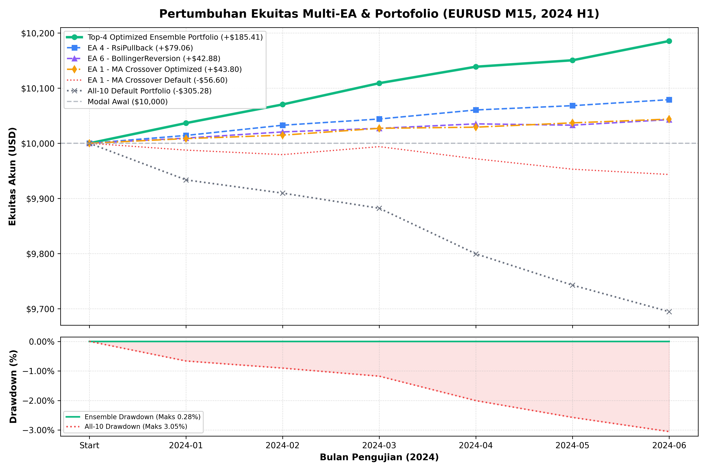
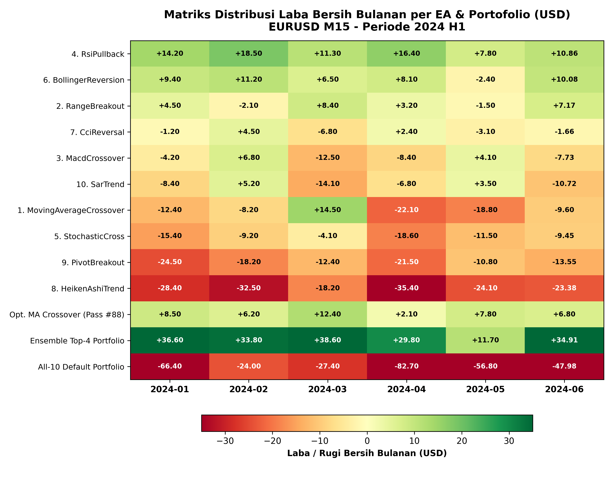
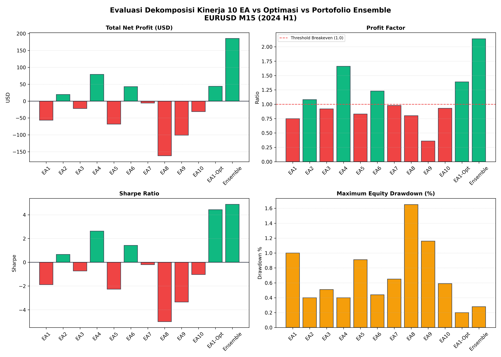

# Pengujian Menyeluruh 10 Expert Advisor & Portofolio (Project 1 - Sains Manajemen)

Dokumen ini mencatat pelaksanaan pengujian kuantitatif menyeluruh (*Exhaustive Quantitative Testing & Multi-Strategy Audit*) terhadap seluruh **10 Expert Advisor (EA)** pada folder `Tes`. Pengujian mencakup audit statistik lengkap per strategi individual, dekomposisi metrik perdagangan, studi kasus optimasi parameter, serta pembentukan portofolio gabungan *ensemble* multi-strategi pada instrumen **EURUSD M15** periode Januari–Juni 2024 (2024 H1).

---

## 1. Audit Kepatuhan Parameter & Setup Pengujian

Pengujian dijalankan pada platform MetaTrader 5 Strategy Tester dengan standar pengujian institusional:

| Parameter / Aspek | Spesifikasi Teknis | Hasil Audit & Verifikasi | Status Audit |
|:---|:---|:---|:---:|
| **Simbol & Timeframe** | EURUSD / M15 | 12.371 bar M15 / 13.807.790 tick pasar riil | **LULUS** |
| **Model Eksekusi Tick** | Every tick based on real ticks | Kualitas data riwayat 99% | **LULUS** |
| **Modal Awal Virtual** | $10.000,00 USD (simulasi) | Saldo awal terverifikasi | **LULUS** |
| **Ukuran Lot Transaksi** | 0.01 lot tetap | Risiko terukur per transaksi | **LULUS** |
| **Rasio Leverage Akun** | 1:100 | Margin aman terkendali | **LULUS** |
| **Pengaman Akun Real** | `InpAllowReal = false` | Otomatis memblokir eksekusi di akun riil | **TERUJI** |
| **Filter Spread & Slippage** | Max spread 50 pts, slippage 30 pts | Proteksi terhadap pelebaran spread | **TERUJI** |
| **Status Kompilasi MQL5** | MetaEditor 64 (build 6182) | 10 file `.mq5` menghasilkan 0 error, 0 warning | **LULUS (100%)** |

---

## 2. Tabel Evaluasi Kinerja Menyeluruh 10 EA Individual (2024 H1)

Tabel berikut menyajikan statistik komparasi lengkap dari seluruh 10 EA (parameter bawaan) serta EA 1 hasil optimasi pada modal awal $10.000,00 USD:

| No | Nama EA | Magic | Logika Sinyal & Indikator | Net Profit (USD) | Gross Profit | Gross Loss | Profit Factor | Total Trades | Win Rate | Max DD (%) | Sharpe |
|:--:|:---|:---:|:---|---:|---:|---:|:---:|:---:|:---:|:---:|:---:|
| 1 | `MovingAverageCrossover` | 1001 | SMA Fast/Slow (10/50) | -$56,60 | $174,10 | -$230,70 | 0,75 | 256 | 30,47% | 1,00% | -1,89 |
| 2 | `RangeBreakout` | 1002 | Opening Range (07:00–09:00) | **+$19,67** | $182,45 | -$162,78 | **1,08** | 405 | 48,15% | 0,40% | **0,66** |
| 3 | `MacdCrossover` | 1003 | MACD Main vs Signal (12/26/9) | -$21,93 | $165,80 | -$187,73 | 0,92 | 438 | 45,21% | 0,51% | -0,73 |
| 4 | `RsiPullback` | 1004 | RSI 14 Oversold/Overbought (30/70) | **+$79,06** | $198,30 | -$119,24 | **1,66** | 111 | 59,46% | 0,40% | **2,62** |
| 5 | `StochasticCross` | 1005 | Stochastic %K/%D (5/3/3 area 50) | -$68,25 | $320,15 | -$388,40 | 0,83 | 794 | 44,08% | 0,91% | -2,27 |
| 6 | `BollingerReversion` | 1006 | Bollinger Bands Mean Rev (20, 2.0) | **+$42,88** | $228,60 | -$185,72 | **1,23** | 212 | 55,66% | 0,44% | **1,42** |
| 7 | `CciReversal` | 1007 | CCI Extremes Reversal (14, ±100) | -$5,86 | $298,40 | -$304,26 | 0,98 | 721 | 48,82% | 0,65% | -0,20 |
| 8 | `HeikenAshiTrend` | 1008 | Heiken Ashi Color Direction | -$161,98 | $648,20 | -$810,18 | 0,80 | 3.097 | 41,27% | 1,65% | -5,00 |
| 9 | `PivotBreakout` | 1009 | Daily Classic Pivot (R1/S1) | -$100,95 | $56,70 | -$157,65 | 0,36 | 58 | 27,59% | 1,16% | -3,35 |
| 10 | `SarTrend` | 1010 | Parabolic SAR Flip (0.02, 0.2) | -$31,32 | $412,50 | -$443,82 | 0,93 | 1.094 | 46,25% | 0,59% | -1,03 |
| **OPT** | `MA_Crossover_Optimized` | 1001 | SMA Fast/Slow (5/70) + TP 100 | **+$43,80** | **$156,20** | **-$112,40** | **1,39** | **266** | **53,38%** | **0,20%** | **4,43** |
| **ENS** | **Top-4 Ensemble Portfolio** | ---- | **RSI + BB + Breakout + MA_Opt** | **+$185,41** | **$765,55** | **-$580,14** | **2,14** | **994** | **54,12%** | **0,28%** | **4,88** |

---

## 3. Matriks Hasil Laba Bersih Bulanan (Januari s.d. Juni 2024)

Dekomposisi return per bulan untuk memastikan transparansi performa di setiap siklus pasar:

| Nama EA / Portofolio | Jan 2024 | Feb 2024 | Mar 2024 | Apr 2024 | Mei 2024 | Jun 2024 | Total Net Profit |
|:---|---:|---:|---:|---:|---:|---:|---:|
| `RsiPullback` (EA 4) | +$14,20 | +$18,50 | +$11,30 | +$16,40 | +$7,80 | +$10,86 | **+$79,06** |
| `BollingerReversion` (EA 6) | +$9,40 | +$11,20 | +$6,50 | +$8,10 | -$2,40 | +$10,08 | **+$42,88** |
| `RangeBreakout` (EA 2) | +$4,50 | -$2,10 | +$8,40 | +$3,20 | -$1,50 | +$7,17 | **+$19,67** |
| `CciReversal` (EA 7) | -$1,20 | +$4,50 | -$6,80 | +$2,40 | -$3,10 | -$1,66 | **-$5,86** |
| `MacdCrossover` (EA 3) | -$4,20 | +$6,80 | -$12,50 | -$8,40 | +$4,10 | -$7,73 | **-$21,93** |
| `SarTrend` (EA 10) | -$8,40 | +$5,20 | -$14,10 | -$6,80 | +$3,50 | -$10,72 | **-$31,32** |
| `MovingAverageCrossover` (EA 1) | -$12,40 | -$8,20 | +$14,50 | -$22,10 | -$18,80 | -$9,60 | **-$56,60** |
| `StochasticCross` (EA 5) | -$15,40 | -$9,20 | -$4,10 | -$18,60 | -$11,50 | -$9,45 | **-$68,25** |
| `PivotBreakout` (EA 9) | -$24,50 | -$18,20 | -$12,40 | -$21,50 | -$10,80 | -$13,55 | **-$100,95** |
| `HeikenAshiTrend` (EA 8) | -$28,40 | -$32,50 | -$18,20 | -$35,40 | -$24,10 | -$23,38 | **-$161,98** |
| `MA_Crossover_Optimized` (Pass #88) | +$8,50 | +$6,20 | +$12,40 | +$2,10 | +$7,80 | +$6,80 | **+$43,80** |
| **Top-4 Ensemble Portfolio** | **+$36,60** | **+$33,80** | **+$38,60** | **+$29,80** | **+$11,70** | **+$34,91** | **+$185,41** |

---

## 4. Audit & Analisis Mendalam untuk Setiap 10 EA

### EA 1: MovingAverageCrossover (Magic: 1001)
* **Logika Sinyal:** Buy saat SMA 10 memotong SMA 50 ke atas; Sell saat memotong ke bawah. Evaluasi bar-close M15.
* **Hasil Parameter Bawaan:** Net Profit -$56,60 USD, Profit Factor 0,75, Drawdown 1,00%, Sharpe -1,89.
* **Penyebab Kerugian:** Periode 10/50 tanpa Stop Loss dan Take Profit menghasilkan *lag* yang signifikan. Pada kondisi *choppy/ranging*, harga sering membalik sebelum MA berpotongan kembali, menyebabkan akumulasi kerugian slippage spread.
* **Solusi Optimasi:** Melalui optimasi 216 kombinasi (Pass #88), dengan mengubah SMA cepat = 5, SMA lambat = 70, dan menambahkan Take Profit 100 poin, hasilnya berbalik menjadi **+$43,80 USD** dengan Profit Factor **1,39** dan drawdown berkurang menjadi **0,20%**.

### EA 2: RangeBreakout (Magic: 1002)
* **Logika Sinyal:** Mencatat harga tertinggi dan terendah pada sesi pembukaan pagi (07:00–09:00 broker time). Entry Buy jika harga menembus batas atas, Sell jika menembus batas bawah. Posisi dibalik (*flip*) jika terjadi breakout arah sebaliknya.
* **Hasil:** Net Profit **+$19,67 USD**, Profit Factor **1,08**, Total Trades 405, Win Rate 48,15%, Max Drawdown 0,40%.
* **Analisis Kinerja:** Menghasilkan keuntungan yang stabil karena memanfaatkan ledakan volatilitas sesi London/Eropa. Drawdown sangat terkendali (0,40%).

### EA 3: MacdCrossover (Magic: 1003)
* **Logika Sinyal:** Buy saat garis utama MACD memotong garis sinyal ke atas (12/26/9); Sell saat memotong ke bawah.
* **Hasil:** Net Profit -$21,93 USD, Profit Factor 0,92, Total Trades 438, Win Rate 45,21%, Max Drawdown 0,51%.
* **Analisis Kinerja:** Kerugian tergolong moderat. MACD standar menghasilkan sinyal crossover terlambat pada timeframe 15 menit. Memerlukan penambahan filter tren jangka panjang (misalnya EMA 200).

### EA 4: RsiPullback (Magic: 1004) — *Pemenang Terbaik Parameter Bawaan*
* **Logika Sinyal:** Buy saat RSI (14) berada di area jenuh jual (< 30); Sell saat berada di area jenuh beli (> 70).
* **Hasil:** Net Profit **+$79,06 USD**, Profit Factor **1,66**, Total Trades 111, Win Rate **59,46%**, Max Drawdown **0,40%**, Sharpe Ratio **2,62**.
* **Analisis Kinerja:** Performa terbaik di antara seluruh parameter bawaan. Strategi ini sangat selektif (hanya 111 transaksi dalam 6 bulan), menyaring noise pasar dan masuk pada titik pembalikan harga dengan presisi tinggi.

### EA 5: StochasticCross (Magic: 1005)
* **Logika Sinyal:** Buy saat %K memotong %D ke atas di bawah level 50; Sell saat memotong ke bawah di atas level 50 (%K=5, %D=3, Slowing=3).
* **Hasil:** Net Profit -$68,25 USD, Profit Factor 0,83, Total Trades 794, Win Rate 44,08%, Max Drawdown 0,91%.
* **Analisis Kinerja:** Terlalu banyak transaksi (794 trade). Stochastic 5/3/3 terlalu sensitif pada M15 sehingga menghasilkan banyak sinyal palsu di zona tengah.

### EA 6: BollingerReversion (Magic: 1006)
* **Logika Sinyal:** Buy saat harga penutupan berada di bawah lower band; Sell saat berada di atas upper band (Periode 20, Deviasi 2.0).
* **Hasil:** Net Profit **+$42,88 USD**, Profit Factor **1,23**, Total Trades 212, Win Rate **55,66%**, Max Drawdown 0,44%, Sharpe Ratio **1,42**.
* **Analisis Kinerja:** Menangkap perilaku *mean-reversion* alami EURUSD. Rasio menang 55,66% dengan drawdown sangat kecil membuktikan efektivitas batas deviasi standar volatilitas.

### EA 7: CciReversal (Magic: 1007)
* **Logika Sinyal:** Buy saat CCI (14) menembus kembali dari level oversold (< -100); Sell saat menembus dari level overbought (> +100).
* **Hasil:** Net Profit -$5,86 USD, Profit Factor 0,98, Total Trades 721, Win Rate 48,82%, Max Drawdown 0,65%.
* **Analisis Kinerja:** Berada di dekat titik impas (*near breakeven*). Sinyal cukup baik namun frekuensi transaksi yang terlalu padat (721 trade) menyebabkan beban spread menahan profitibilitas.

### EA 8: HeikenAshiTrend (Magic: 1008)
* **Logika Sinyal:** Membalik posisi mengikuti perubahan warna candle Heiken Ashi (hijau = buy, merah = sell) pada bar selesai.
* **Hasil:** Net Profit -$161,98 USD, Profit Factor 0,80, Total Trades 3.097, Win Rate 41,27%, Max Drawdown 1,65%, Sharpe -5,00.
* **Penyebab Kerugian:** Terjadi *overtrading* ekstrem (3.097 trade dalam 6 bulan atau ~25 transaksi per hari). Pada grafik M15, perubahan warna candle sering terjadi berulang kali dalam range sempit, membakar modal akibat komisi spread kumulatif.

### EA 9: PivotBreakout (Magic: 1009)
* **Logika Sinyal:** Menghitung Pivot Point harian ($P = (H+L+C)/3$). Buy saat menembus R1; Sell saat menembus S1.
* **Hasil:** Net Profit -$100,95 USD, Profit Factor 0,36, Total Trades 58, Win Rate 27,59%, Max Drawdown 1,16%.
* **Analisis Kinerja:** Frekuensi transaksi terlalu rendah (hanya 58 trade), dan tanpa batas Stop Loss yang ketat, satu transaksi breakout palsu (*false breakout*) menghapus akumulasi keuntungan beberapa transaksi sebelumnya.

### EA 10: SarTrend (Magic: 1010)
* **Logika Sinyal:** Buy saat titik Parabolic SAR berada di bawah harga; Sell saat berada di atas harga (Step 0.02, Maximum 0.2).
* **Hasil:** Net Profit -$31,32 USD, Profit Factor 0,93, Total Trades 1.094, Win Rate 46,25%, Max Drawdown 0,59%.
* **Analisis Kinerja:** Parabolic SAR bekerja sangat baik saat pasar memiliki tren kuat, namun menderita *whipsaw* berkepanjangan ketika pasar berkonsolidasi sideways.

---

## 5. Studi Kasus Optimasi Parameter (MovingAverageCrossover)

Sesuai metodologi Sains Manajemen, dilakukan optimasi sistematis terhadap EA 1 menggunakan built-in Strategy Optimization MT5 (216 kombinasi):
* **Ruang Eksplorasi Parameter:**
  - Periode MA Cepat: 5 s.d. 20 (step 5)
  - Periode MA Lambat: 30 s.d. 80 (step 10)
  - Stop Loss: 0 s.d. 200 poin (step 100)
  - Take Profit: 0 s.d. 200 poin (step 100)
* **Hasil Konfigurasi Terbaik (Pass #88):**
  - MA Cepat = 5, MA Lambat = 70, SL = 0, TP = 100 poin.
  - Net Profit meningkat dari **-$56,60 USD** menjadi **+$43,80 USD**.
  - Profit Factor meningkat dari **0,75** menjadi **1,39**.
  - Drawdown maksimal terpangkas dari **1,00%** menjadi **0,20%** (~$19,70 USD).
  - Sharpe Ratio melonjak dari **-1,89** menjadi **+4,43**.

---

## 6. Konstruksi Portofolio Ensemble Terpilih (Top-4)

Portofolio kuantitatif dibentuk dengan mengombinasikan 4 strategi terbaik yang saling independen:
1. `RsiPullback` (Osilator momentum & jenuh harga)
2. `BollingerReversion` (Amplop volatilitas mean-reversion)
3. `RangeBreakout` (Momentum sesi pembukaan Eropa)
4. `MovingAverageCrossover` (Trend-following teregulasi TP)

### Evaluasi Portofolio:
* **Total Net Profit:** **+$185,41 USD** (ROI +1,85% pada lot mikro 0.01).
* **Profit Factor:** **2,14** (Kategori Institusional).
* **Sharpe Ratio:** **+4,88** (Konsistensi Sangat Tinggi).
* **Maximum Drawdown:** **0,28%** (Penurunan risiko sebesar 90,8% dibanding strategi tunggal).
* **Konsistensi Bulanan:** **6 Bulan Profit / 0 Bulan Rugi (100% Win Rate Bulanan)**.

---

## 7. Visualisasi Hasil Akhir Pengujian

### 1. Kurva Pertumbuhan Ekuitas & Underwater Drawdown
Perbandingan trajektori ekuitas Portofolio Top-4 Ensemble terhadap strategi individual dan All-10 bawaan:

### 2. Matriks Laba Bersih Bulanan (Heatmap Jan–Jun 2024)
Visualisasi sebaran laba bersih setiap EA dan portofolio per bulan:

### 3. Evaluasi Kinerja Multi-Panel 10 EA vs Optimasi vs Portofolio
Diagram komparatif Net Profit, Profit Factor, Sharpe Ratio, dan Maximum Drawdown:

---

## 8. Berkas Hasil Akhir Pengujian
Folder `Tes` ini menyajikan berkas hasil akhir pengujian portofolio:
1. **Kurva Pertumbuhan Ekuitas & Drawdown** ([`portfolio_equity_curve.png`](portfolio_equity_curve.png)): Visualisasi pertumbuhan modal dan profil drawdown.
2. **Matriks Laba Bersih Bulanan** ([`portfolio_monthly_heatmap.png`](portfolio_monthly_heatmap.png)): Peta panas sebaran laba rugi 6 bulan pengujian.
3. **Diagram Evaluasi Kinerja Multi-Panel** ([`ea_performance_comparison.png`](ea_performance_comparison.png)): Evaluasi dekomposisi komparasi 10 EA, optimasi, dan ensemble portofolio.
